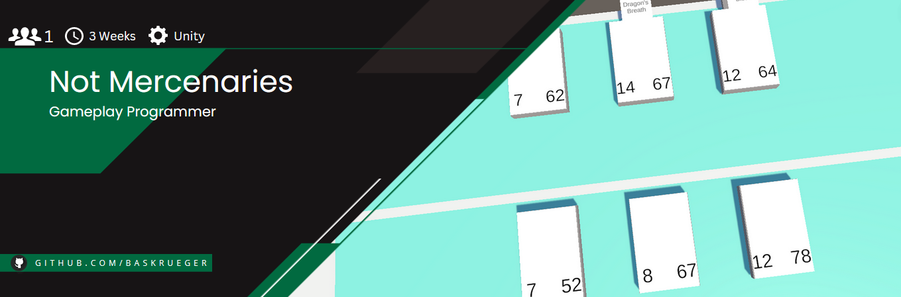

# Not-Mercenaries
<p align="center">
    <br>
</p>

"Not Mercenaries" is a prototype clone of Hearthstones ["Mercenaries"](https://www.youtube.com/watch?v=JDthFgkAPUE) modes combat System. This projects main purpose was to challange myself by creating a complicated turn based combat system that's also easy to expand with new cards and mechanics in the future.

# Gameplay

https://github.com/BasKrueger/NotMercenaries/assets/147401575/69f8dc9c-23eb-45ac-b4e8-7fe01c0b814b

"Not Mercenaries" is a turn based pve strategy card game. Players first place down 3 of their 6 inital mercenaries in the Deploy phase. After that comes the Preparation phase where you can select your Mercenaries to queue up one of their abilities each turn. After the player ends their turn the combat phase begins, where the queued up abilities are played out, before returning to the preperation phase. The player who manage to defeat all 6 of their enemies Mercs wins the game.

# How to run
Clone this repository and open the project folder using at least Unity Version 2021.3.1. 

# Highlight: Expandability
```
public class CrusadersBlow : AbstractAbility
    {
        public CrusadersBlow(int id) : base
            (
                id: id,

                name: "Crusaders Blow",
                description: "Attack an enemy. Deathblow: Restore <h> health to this merc.",
                speed: 6,
                targets: abilityTargets.single | abilityTargets.enemy,
                school: SpellSchool.holy,
                healing: 60
            )
        {
        }

        public override void OnPlay(PlayAbilityAction cause)
        {
            ActionManager.AddNext(new AttackAction(cause.owner, cause.target));
            base.OnPlay(cause);
        }

        public override void Deathblow(DeathblowAction cause)
        {
            ActionManager.AddNext(new HealDamageAction(cause.owner, cause.owner, base.healing));
            base.Deathblow(cause);
        }
    }
```
One of my goals with this project was to make adding new content as easy as possible. As you can see all you have to do to create a new ablity is to create a class that inherits from "AbstractAbility", define its generic traits (speed, description, targets etc.) in the constructer, aswell as defining the next Action in the abstract "OnPlay" Function. Actions are events that can happen throughout the game (dealing damage, attacking an enemy, applying a buff etc.) which are queued up, before getting executeted by the Actionmanager. Those Actions also take over tasks like calling the virtual "Deathblow" function whenever a damage action kills a target. 

Those actions can also be manipulated to create more complicated card effects. Take this buff effect for example:
```
 public class SalvationBuff : AbstractBuff
    {
        public SalvationBuff(int id) : base
            (
                id: id,

                name: "Salvation",
                description: "takes <m1> less damage this turn",
                magicNumber1: 10
            )
        { }

        public override void WheneverDealDamage(DealDamageAction cause)
        {
            if(cause.target == base.owner)
            {
                cause.damage -= 10;
            }
            base.WheneverDealDamage(cause);
        }

        public override void TurnEnd(TurnEndAction cause)
        {
            ActionManager.AddNext(new RemoveBuffAction(cause.owner, this, base.owner));
            base.TurnEnd(cause);
        }
    }
```
Most actions also call specific functions on all cards that are currently in the game. "Whenever" functions are usually called before and "after" functions after the actual action effect resolves. In this case I overwrite "WheneverDealDamage" function and reduce the damage it deals by 10, if the owner Mercenary of the buff gets targeted, which reduces the damage before it gets applied to the target.

In short: The action System is one of the main Systems that makes it easy and fast to create reliable new cards with all kinds of different effects in a game designer friendly way.
